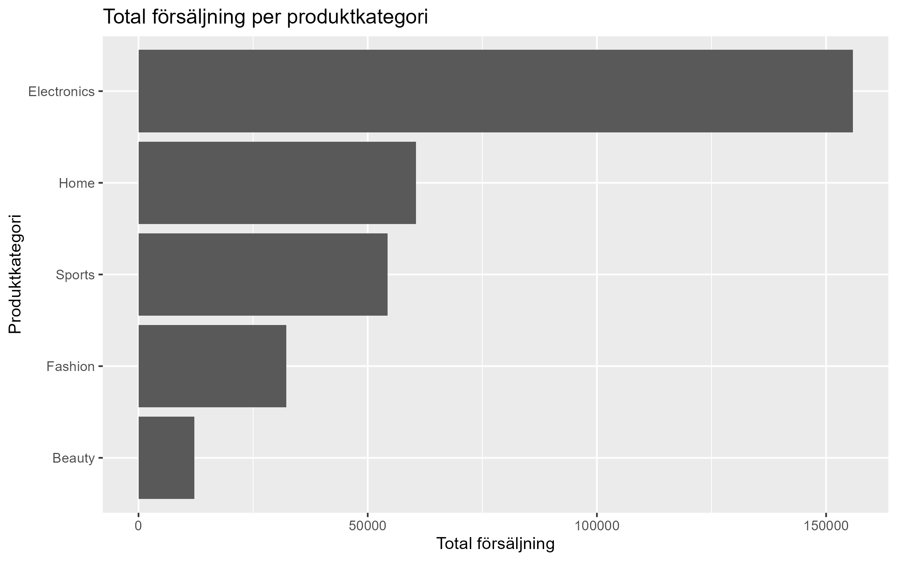
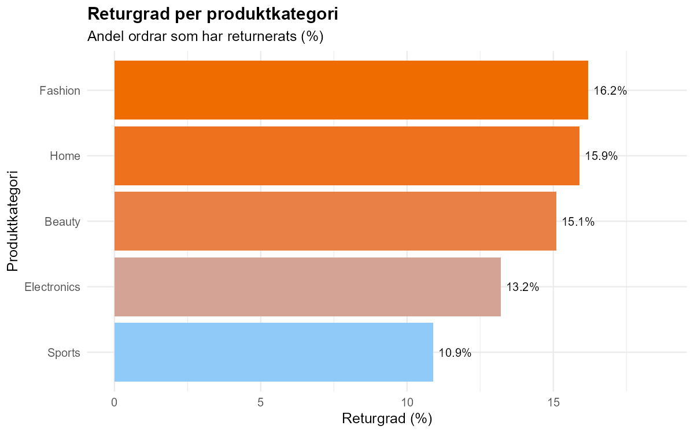
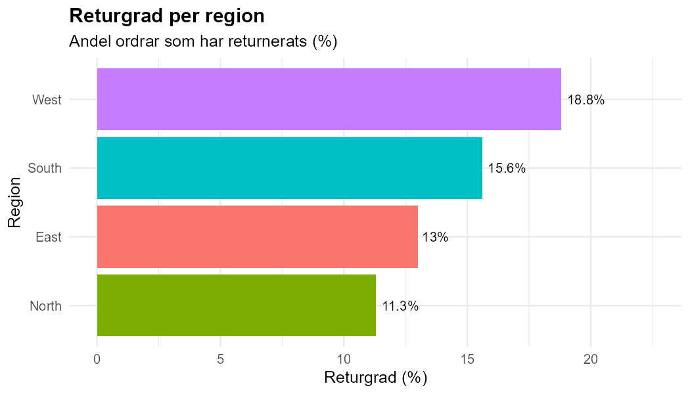
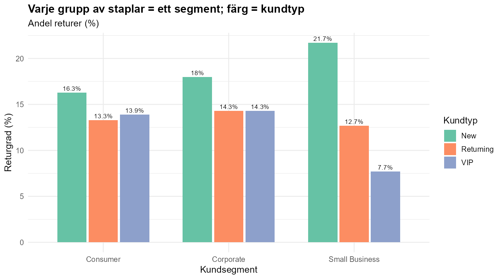
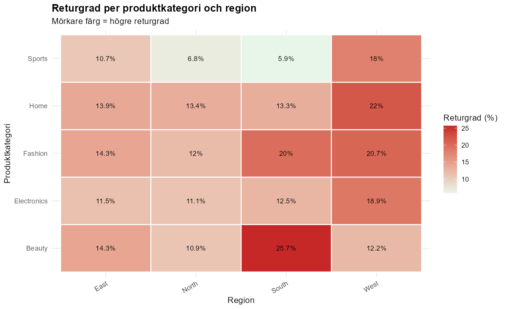
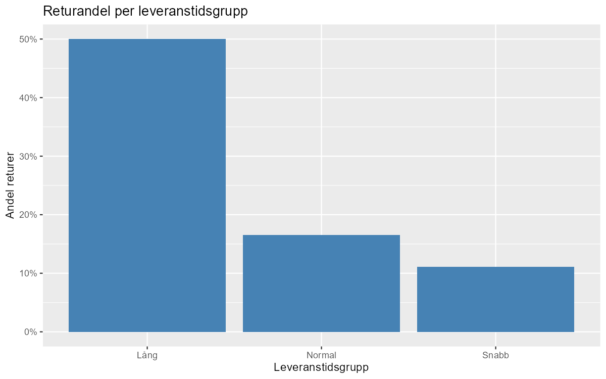

```{r setup, include=FALSE}
knitr::opts_chunk$set(echo = FALSE, warning = FALSE, message = FALSE)
library(readr)
library(dplyr)
library(knitr)
library(tibble)

data <- read_csv("../data/bearbetad/ecommerce_orders_stadad.csv", show_col_types = FALSE)
```

# Syfte

Syftet med denna analys är att undersöka försäljning, returgrad och leveranstid i ett e-handelsdataset. Målet är att få fram insikter som kan vara användbara för företaget i arbetet med försäljning, kundförståelse och förbättring av leverans och returhantering.

# Valda frågeställningar

Gruppen har arbetat med följande frågor:

1. Vilka produktkategorier driver högst försäljning?
2. Hur skiljer sig returgrad mellan olika grupper?
3. Finns det tecken på att längre leveranstid hänger ihop med fler returer?

# Dataset och dataförståelse

Datasetet innehåller orderdata från ett e-handelsföretag. Det innehåller information om bland annat kundsegment, region, produktkategori, antal, pris, rabatt, leveranstid och returstatus.

```{r data-oversikt}
oversikt <- tibble(
  Mått = c("Antal rader", "Antal kolumner"),
  Värde = c(nrow(data), ncol(data))
)

kable(oversikt, caption = "Översikt över datamängden")
```

```{r saknade-varden}
saknade <- tibble(
  variabel = names(data),
  saknade_varden = colSums(is.na(data))
) %>%
  filter(saknade_varden > 0) %>%
  arrange(desc(saknade_varden))

kable(saknade, caption = "Kolumner med saknade värden")
```

Vi såg att det fanns saknade värden i bland annat `city`, `payment_method`, `campaign_source` och `shipping_days`.

# Datastädning och nya variabler

Innan analysen genomfördes städades datat för att göra det mer enhetligt och lättare att arbeta med.

Det som gjordes var:

- textvärden städades så att stavning och format blev mer enhetliga
- saknad rabatt sattes till 0 för att kunna räkna vidare på pris och ordervärde
- en städad version av datat sparades för fortsatt analys

Vi skapade också följande nya variabler:

- **pris_efter_rabatt** = `unit_price * (1 - discount_pct)`
- **ordervarde** = `quantity * pris_efter_rabatt`
- **retur_binart** = 1 om ordern returnerats, annars 0
- **leveransgrupp** = grupperad leveranstid (kort/medel/lång)

# Resultat

## 1. Vilka produktkategorier driver högst försäljning?

```{r tabell-forsaljning}
forsaljning <- data %>%
  group_by(product_category) %>%
  summarise(
    total_forsaljning = round(sum(ordervarde, na.rm = TRUE), 0),
    medel_ordervarde = round(mean(ordervarde, na.rm = TRUE), 1),
    antal_ordrar = n(),
    .groups = "drop"
  ) %>%
  arrange(desc(total_forsaljning))

kable(forsaljning, caption = "Försäljning per produktkategori")
```

```{r figur-forsaljning, out.width="90%", fig.align='center'}

```

Resultatet visar att **Electronics** står för högst total försäljning. Därefter kommer **Home** och **Sports**. **Beauty** har lägst total försäljning i detta dataset.

Det tyder på att vissa kategorier står för en större del av intäkterna och därför kan vara särskilt viktiga för företaget att följa upp.

## 2. Hur skiljer sig returgrad mellan olika grupper?

### Returgrad per produktkategori

```{r tabell-retur-kategori}
retur_kategori <- data %>%
  group_by(product_category) %>%
  summarise(
    antal_ordrar = n(),
    returgrad_pct = round(mean(retur_binart, na.rm = TRUE) * 100, 1),
    .groups = "drop"
  ) %>%
  arrange(desc(returgrad_pct))

kable(retur_kategori, caption = "Returgrad per produktkategori")
```

```{r figur-retur-kategori, out.width="85%", fig.align='center'}

```

Här ser vi att **Fashion** har högst returgrad, följt av **Home** och **Beauty**. **Sports** har lägst returgrad.

### Returgrad per region

```{r tabell-retur-region}
retur_region <- data %>%
  group_by(region) %>%
  summarise(
    antal_ordrar = n(),
    returgrad_pct = round(mean(retur_binart, na.rm = TRUE) * 100, 1),
    .groups = "drop"
  ) %>%
  arrange(desc(returgrad_pct))

kable(retur_region, caption = "Returgrad per region")
```

```{r figur-retur-region, out.width="80%", fig.align='center'}

```

Returgraden är högst i **West** och lägst i **North**. Det kan tyda på att det finns regionala skillnader som är värda att undersöka vidare.

### Returgrad per kundsegment och kundtyp

```{r tabell-retur-segment-kundtyp}
retur_segment_kundtyp <- data %>%
  group_by(customer_segment, customer_type) %>%
  summarise(
    antal_ordrar = n(),
    returgrad_pct = round(mean(retur_binart, na.rm = TRUE) * 100, 1),
    .groups = "drop"
  ) %>%
  arrange(desc(returgrad_pct))

kable(retur_segment_kundtyp, caption = "Returgrad per kundsegment och kundtyp")
```

```{r figur-retur-segment-kundtyp, out.width="90%", fig.align='center'}

```

Den här jämförelsen visar att returgraden inte bara skiljer sig mellan segment, utan också mellan olika kundtyper inom samma segment. Exempelvis sticker vissa grupper ut mer än andra, vilket kan vara relevant för riktade förbättringar.

### Returgrad per produktkategori och region

```{r figur-retur-heatmap, out.width="90%", fig.align='center'}

```

Heatmapen visar att vissa kombinationer av kategori och region har särskilt hög returgrad. Ett tydligt exempel är **Beauty i South**, som har högre returgrad än många andra kombinationer.

## 3. Finns det tecken på att längre leveranstid hänger ihop med fler returer?

```{r tabell-leveranstid}
leverans <- data %>%
  mutate(leveranstidsgrupp = case_when(
    shipping_days >= 5 ~ "Lång",
    shipping_days %in% c(3, 4) ~ "Normal",
    shipping_days %in% c(1, 2) ~ "Snabb",
    TRUE ~ NA_character_
  )) %>%
  filter(!is.na(leveranstidsgrupp)) %>%
  group_by(leveranstidsgrupp) %>%
  summarise(
    antal_ordrar = n(),
    returandel = round(mean(retur_binart, na.rm = TRUE) * 100, 1),
    .groups = "drop"
  ) %>%
  arrange(desc(returandel))

kable(leverans, caption = "Returandel per leveranstidsgrupp")
```

```{r figur-leveranstid, out.width="85%", fig.align='center'}

```

Här ser vi tydliga tecken på att längre leveranstid hänger ihop med högre returandel. Gruppen med **lång** leveranstid har högst returandel, medan gruppen med **snabb** leveranstid har lägst.

Det här bevisar inte orsak och verkan, men det visar ett tydligt mönster i datat.

# Sammanfattning av viktigaste resultat

De viktigaste resultaten i analysen är:

- **Electronics** driver högst total försäljning.
- **Fashion** har högst returgrad bland produktkategorierna.
- **West** har högst returgrad bland regionerna.
- Det finns skillnader i returgrad mellan olika kundsegment och kundtyper.
- Längre leveranstid verkar hänga ihop med fler returer.

# Slutsatser

Analysen visar att företaget bör följa både försäljning och returer på ett mer detaljerat sätt. Vissa kategorier driver mycket försäljning, medan andra kategorier eller regioner har högre returgrad.

Det finns också tecken på att leveranstid kan påverka returandelen. Därför kan det vara värdefullt för företaget att arbeta vidare med både logistik och uppföljning av kundbeteende.

# Begränsningar

Det finns några begränsningar i analysen:

- vissa värden saknas i datat
- analysen är utforskande och visar samband, men inte säkra orsaker
- vi har bara utgått från det dataset vi fått och inte från fler externa faktorer

# Nästa steg

Om företaget vill gå vidare kan följande vara intressant:

- undersöka varför vissa kategorier har högre returgrad
- analysera regioner med hög returgrad mer i detalj
- följa upp om kortare leveranstider kan minska returer
- komplettera med mer information om kunder, produkter och kampanjer
